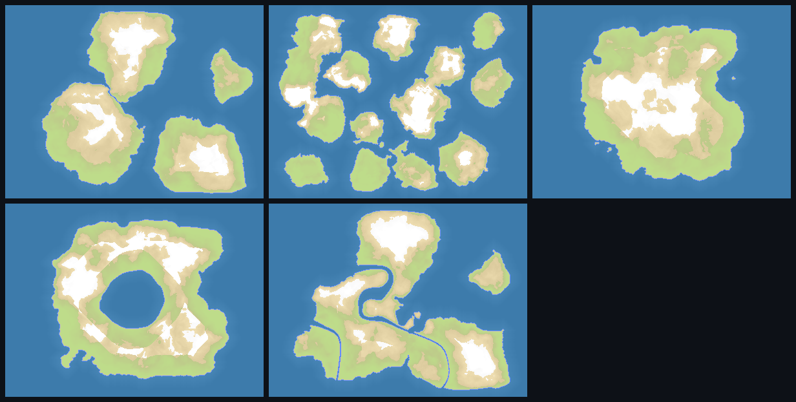

# Procedural Maps

In-game procedural map generation for single-player games.

Adds a **Generate Map** card to the single-player map picker. Pick an archetype, move a few sliders, watch the map update live, and play it. Terrain is calibrated against statistics measured from all 127 maps under `resources/maps`, so generated maps read like OpenFront maps rather than like noise.



> Left to right, top to bottom: Continents, Archipelago, Pangaea, Inland Sea, Lakes & Rivers.

This is a companion to the offline [MapGenerator](../map-generator/README.md), not a replacement. That tool turns hand-drawn PNGs into the shipped maps under `resources/maps`; this one builds a map in the browser at the moment the player asks for it, and writes nothing to disk.

---

## Scope and limitations

- **Single-player only.** A generated map's terrain exists only in the player's browser and is never uploaded, so it cannot reach a server or another player. The generator card is shown only by `SinglePlayerModal`; `HostLobbyModal` and `JoinLobbyModal` leave it off.
- **Generated games are not archived as replays.** A replay record identifies a map by id and nobody else could resolve a generated one, so `LocalServer` skips archiving them deliberately rather than writing records that would fail to load.
- **Island count is approximate at the high end.** Asking for 14 reliably gives around 11. Land coverage, by contrast, is hit to within half a percent. The UI reports the achieved count, not the requested one.
- **No map layers.** Generated maps do not define the optional decorative layers some shipped maps use.
- **Not verified in a real browser.** The integration is covered by tests against the game's real loader plus jsdom component tests, and the dev server serves every module, but no generated map has been played end to end in a browser.

---

## Usage

Run the game, open **Single Player**, and click **Generate Map** in the map picker's Special section, beside Random.

| Control                 | Effect                                                                                                 |
| ----------------------- | ------------------------------------------------------------------------------------------------------ |
| **Archetype**           | Continents, Archipelago, Pangaea, Inland Sea, Lakes & Rivers                                           |
| **Islands**             | Target number of landmasses. Disabled for Pangaea and Inland Sea, which are one landmass by definition |
| **Land coverage**       | Share of the map that is land, 10–70%                                                                  |
| **Mountainousness**     | Shifts the elevation distribution up or down                                                           |
| **Coastline roughness** | How ragged and fjorded the coasts are                                                                  |
| **Nations**             | Number of AI nation spawn points, 0–64                                                                 |
| **Map size**            | Small 1000×752, Medium 1500×1128, Large 2000×1500                                                      |
| **Seed**                | Any 32-bit integer. The same seed and settings always produce the same map                             |

The preview runs the real generator at reduced resolution, so it is the map you will get rather than an impression of it. The line beneath it reports what the generator actually achieved — `~11 islands · 40% land`.

**Generate & Use** builds the map at full size in a worker, then the normal start-game path plays it.

---

## Building and running

Nothing extra is required; this is part of the normal client build.

```bash
npm install
npm run dev # client + local server
```

Production build:

```bash
npm run build-prod
```

The generator compiles to its own ~85 kB chunk (`MapGen.worker-*.js`), loaded on demand rather than in the main bundle.

### Generation cost

| Size      | Time       |
| --------- | ---------- |
| 1000×752  | ~1.0–1.6 s |
| 1500×1128 | ~1.9–2.3 s |
| 2000×1500 | ~3.2–3.8 s |

Full-size generation runs in a dedicated worker so the menu stays responsive. The live preview runs on the main thread in a few milliseconds.

---

## How terrain is calibrated

`npm run analyze-maps` reads every `map.bin` under `resources/maps` and writes `resources/mapStyleProfile.json` (~15 KB, committed). Two measurements do real work in the generator:

- **Elevation histogram.** Land heights are assigned by histogram-matching against the real distribution rather than by scaling noise into a range, so the mix of plains, highland and mountain matches the shipped maps by construction.
- **Elevation by distance from coast.** The shipped maps rise from a mean magnitude of 4.7 at the shoreline to 9.8 twenty tiles inland. Feeding that curve back in is what puts mountains in the interior; thresholded noise alone scatters peaks onto beaches.

Only **three** archetypes are measured — Continents, Archipelago and Pangaea — because only three are present in the data. Maps named for inland seas (Black Sea, Caspian, Baikal) measure near-zero enclosed water, because on those maps the named sea _is_ the largest water body and is therefore flagged as ocean; just 3 of 127 maps have meaningfully enclosed water. Inland Sea and Lakes & Rivers are therefore generation _techniques_ calibrated from the measured families, not clusters invented from one or two members. The profile file records this in its `archetypeNotes` field.

Re-run the analysis after adding maps upstream:

```bash
npm run analyze-maps # a few minutes; prints a per-map classification table
```

---

## File tree

### New files

```
resources/
└── mapStyleProfile.json          Statistics measured from the 127 shipped maps

scripts/
├── analyzeMaps.ts                Regenerates the profile above
└── previewGeneratedMaps.ts       Dev harness: one PNG per archetype

src/core/game/generator/          The generator. No DOM dependencies, so it
│                                 runs in a worker and is unit-testable.
├── MapGenTypes.ts                Params, archetypes, synthetic map ids
├── Noise.ts                      Seeded value noise, fBm, domain warp
├── LandMask.ts                   Island placement, field, coverage solve
├── Elevation.ts                  Histogram-matched terrain height
├── TerrainGrid.ts                Working grid representation
├── TerrainPostProcess.ts         Port of map_generator.go: ocean flood fill,
│                                 shorelines, depth BFS, island/lake removal
├── PackTerrain.ts                Bit packing and 2× downscaling
├── Nations.ts                    Spawn placement and naming
├── Thumbnail.ts                  Map-picker colours
├── GenerateMap.ts                Orchestration
├── MapStyleProfile.ts            Typed access to the measured profile
├── GeneratedMapRegistry.ts       Serves generated maps through GameMapLoader
├── MapGen.worker.ts              Off-main-thread generation
└── MapGenClient.ts               Main-thread worker API

src/client/components/map/
├── MapGeneratorPanel.ts          The UI panel and live preview
└── GeneratedMapStore.ts          Registers a generated map, builds its thumbnail

tests/
├── MapGeneratorParity.test.ts
├── MapGeneratorInvariants.test.ts
├── MapGeneratorDeterminism.test.ts
├── MapGeneratorWiring.test.ts
└── client/MapGeneratorPanel.test.ts
```

### Modified files

| File                                          | Change                                                                                                                                                                                                        |
| --------------------------------------------- | ------------------------------------------------------------------------------------------------------------------------------------------------------------------------------------------------------------- |
| `src/client/TerrainMapFileLoader.ts`          | Wraps the loader so generated ids resolve from memory. **The key hook** — every main-thread consumer goes through this one instance, so wrapping it covers thumbnails, nation counts and the renderer at once |
| `src/core/game/TerrainMapLoader.ts`           | Adds `evictGeneratedTerrainMaps`                                                                                                                                                                              |
| `src/core/worker/WorkerMessages.ts`           | Optional `generatedMap` on `InitMessage`                                                                                                                                                                      |
| `src/core/worker/WorkerClient.ts`             | Forwards it to the worker                                                                                                                                                                                     |
| `src/core/worker/Worker.worker.ts`            | Registers it and composites its own loader                                                                                                                                                                    |
| `src/client/ClientGameRunner.ts`              | Passes the terrain to the worker at game start                                                                                                                                                                |
| `src/client/LocalServer.ts`                   | Skips replay archiving for generated maps                                                                                                                                                                     |
| `src/client/components/map/MapPicker.ts`      | The Generate Map card                                                                                                                                                                                         |
| `src/client/components/GameConfigSettings.ts` | Passes generator props through                                                                                                                                                                                |
| `src/client/SinglePlayerModal.ts`             | Panel state and the map-ready handler                                                                                                                                                                         |
| `resources/lang/en.json`                      | `map_generator.*` strings                                                                                                                                                                                     |
| `package.json`                                | `analyze-maps` script                                                                                                                                                                                         |
| `tsconfig.json`                               | Typechecks top-level `scripts/*.ts`                                                                                                                                                                           |
| `.gitignore`                                  | Ignores the dev harness's PNG output                                                                                                                                                                          |

---

## Design notes

### The map id

Generated maps use a synthetic id, `Generated:<paramhash>`, and are deliberately **never** added to `src/core/game/Maps.gen.ts` — that file is generated by the Go tool and marked do-not-edit. The hash covers the seed and every parameter, so two different generated maps cannot collide in `TerrainMapLoader`'s cache while an identical regeneration reuses it.

The single `as GameMapType` cast lives in `generatedMapId()`. It is safe because every consumer either looks the id up in `maps` and tolerates a miss (`getMapName`, `resolveTribeNameData`, `MapPlaylist`) or routes it through the composite loader.

### Getting terrain to the simulation worker

The map is loaded twice and independently: once on the main thread for rendering, once inside the game worker for simulation. The worker builds its own `FetchGameMapLoader` and cannot see main-thread state, so a generated map travels with the `init` message.

It is sent as an ordinary **structured clone, not a transfer**. The main thread has already handed those same buffers to its `GameMapImpl`, which keeps and mutates them for the life of the game; transferring would detach the terrain out from under the renderer. Copying ~4 MB once at game start is the cheaper mistake to avoid.

### Determinism

Generation is deterministic from the seed, on any engine. It uses the project's `PseudoRandom` (sfc32, integer ops only) and `DetMath.exp`, and avoids `Math.sin`/`Math.cos` entirely — those are only "implementation approximated" by the spec, and a last-bit difference would make a seed produce a different map in a different browser. Island orientations come from a rejection-sampled unit vector instead, which needs only arithmetic and `Math.sqrt`.

### Controlling island count

Thresholding a noise field gives no control over how many landmasses emerge, which is the one thing the UI promises. Instead, island centres are placed by Mitchell best-candidate sampling, evened out by pairwise relaxation, and given radii capped against the spacing that actually exists. The threshold is then bisected to hit land coverage exactly, the resulting count is measured, and the field parameters are corrected — a search that runs at 1/5 linear scale, which is what makes six attempts affordable.

Two findings from tuning that are worth not rediscovering:

- **Uneven centre spacing is what fuses islands.** Before relaxation, a request for 14 produced 6. Radius adjustments barely moved it; spacing was the cause.
- **Noise amplitude and coastline raggedness had to be separated.** Adding noise to the field raises it everywhere, including the channels between islands, so making coasts ragged that way also fused neighbours. Displacing the island _shape_ instead moves land without creating any, so coasts stay ragged while islands stay separate. That is the `shapeWarp` parameter.

---

## Tests

```bash
npx vitest run tests/MapGenerator tests/client/MapGeneratorPanel.test.ts
```

90 tests across five files:

- **`MapGeneratorParity`** — the important one. Decodes four shipped `map.bin` files, re-runs the ported pipeline over them, and requires **byte-identical** output, including the 4× downscale and a map with impassable terrain. This validates the Go→TypeScript port against real data rather than against a reading of the Go source.
- **`MapGeneratorInvariants`** — format validity, ocean connectivity, shoreline correctness, minimum island and lake sizes, nations on land, slider response.
- **`MapGeneratorDeterminism`** — same seed gives byte-identical maps; different seeds do not; no state leaks between runs.
- **`MapGeneratorWiring`** — composite loader, terrain cache keys, registry bounds, and loading through the real `loadTerrainMap`.
- **`client/MapGeneratorPanel`** — the UI panel under jsdom.

These suites raise vitest's 5 s default, because they process millions of tiles per case.

### Dev harness

```bash
npx tsx scripts/previewGeneratedMaps.ts
```

Writes one PNG per archetype to `.mapgen-preview/` and prints requested-vs-achieved figures. The fastest way to judge a generator change by eye.
